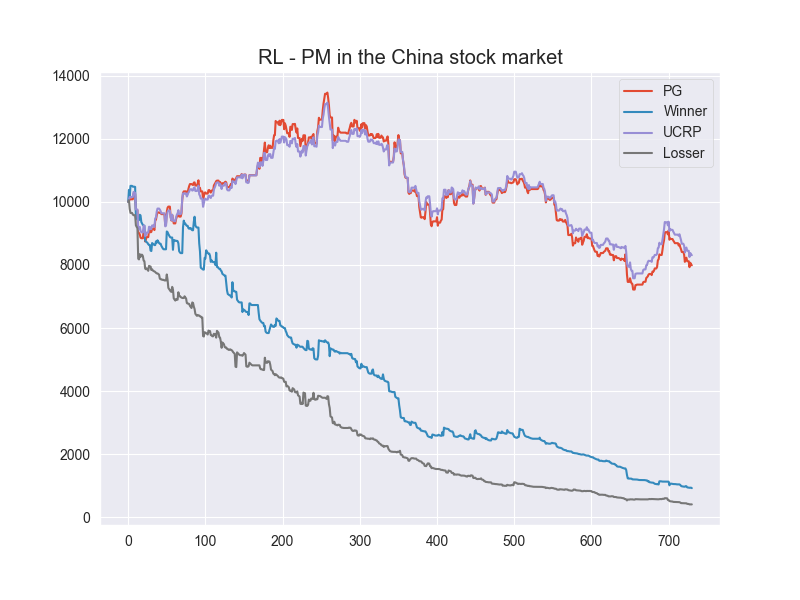
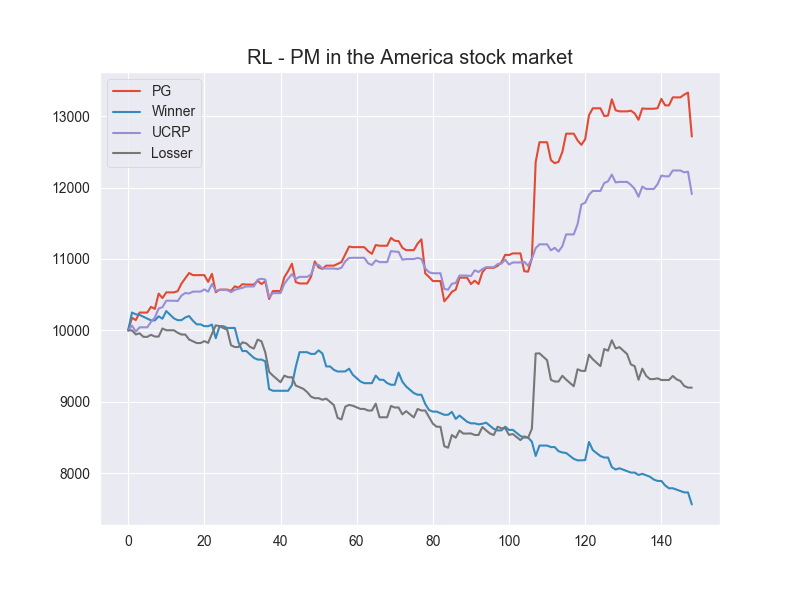
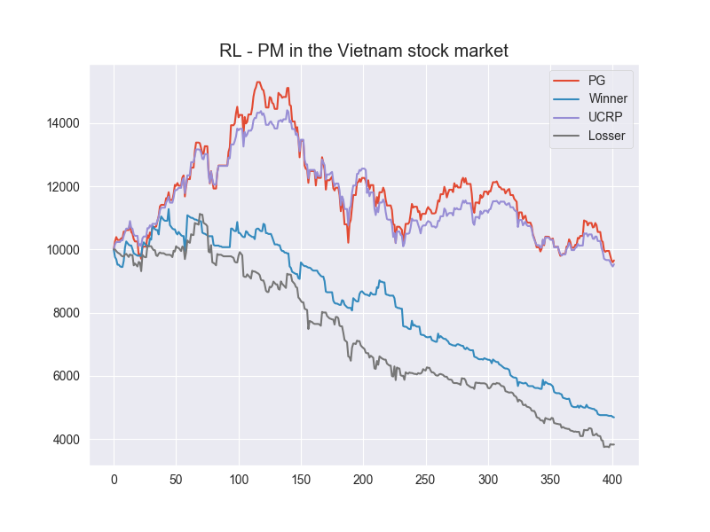

Editted from [liangzp-RL-PM](https://github.com/liangzp/Reinforcement-learning-in-portfolio-management-)
# Reinforcement learning in portfolio management
Implement the reinforcement learning in portfolio management in 3 stock markets: Vietnam, America and China


## Introduction

Motivated by "A Deep Reinforcement Learning Framework for the Financial Portfolio Management Problem" by [Jiang et. al. 2017](https://arxiv.org/abs/1706.10059) [1]. In this project:
+ Implement three state-of-art continous deep reinforcement learning algorithms, Deep Deterministic Policy Gradient (DDPG),Proximal Policy Optimization(PPO) and Policy Gradient (PG) in portfolio management. 

+ Experiments on different settings, such as changing learning rates, optimizers, neutral network structures, China/America Stock data, initializers, noise, features to figure out their influence on the RL agents' performance(cumulative return).

  In this paper, we implement three state-of-art continuous reinforcement learning algorithms, Deep Deterministic Policy Gradient (DDPG), Proximal Policy Optimization (PPO) and Policy Gradient (PG)in portfolio management. All of them are widely-used in game playing and robot control. What's more, PPO has appealing theoretical propeties which is hopefully potential in portfolio management. We present the performances of them under different settings, including different learning rates, objective functions, feature combinations, in order to provide insights for parameters tuning, features selection and data preparation. We also conduct intensive experiments in China Stock market and show that PG is more desirable in financial market than DDPG and PPO, although both of them are more advanced. What's more, we propose a so called Adversarial Training method and show that it can greatly improve the training efficiency and significantly promote average daily return and sharpe ratio in back test. Based on this new modification, our experiments results show that our agent based on Policy Gradient can outperform UCRP.
## Using the environment

The environment provides supports for easily testing different reinforcement learning in portfolio management.
+ main.py -  the entrance to run our training and testing framework
+ ./saved_network- contains different saved models after training, with DDPG and PPO sub folders
+ ./summary- contains summaries, also with DDPG and PPO sub folder
+ ./agent- contains ddpg.py, ppo.py and ornstein_uhlenbeck.py(the noise we add to agent's actions during training)
+ ./data- contains America.csv for USA stock data, China.csv for China stock data. download_data.py can download China stock data by Tushare. environment.py generates states data for trading agents.
+ config.json- the configuration file for training or testing settings
Download stock data in shenzhen and shanghai stock market in the given period in Day(D) frequency. Options: hours, minutes
```
python main.py --mode=download_data
```
Training/Testing
```
python main.py --mode=train
```

```
python main.py --mode=test
```
+ noise_flag=True: actions produced by RL agents are distorted by adding UO noise.
+ record_flag=True: trading details would be stored as a csv file named by the epoch and cumulative return each epoch.
+ plot_flag=True: the trend of wealth would be plot each epoch.
+ reload_flag=True: tensorflow would search latest saved model in ./saved_network and reload.
+ trainable=True: parameters would be updated during each epoch.
+ method=model_based: the first epochs our agents would try to imitate a greedy strategy to quickly improve its performance. Then it would leave it and continue to self-improve by model-free reinforcement learning.

## Result
+ Backtest data (China)
  
+ Backtest data (America)
  
+ Backtest data (Vietnam)
  


**The other results can be found in our paper.**
(http://arxiv.org/abs/1808.09940)


